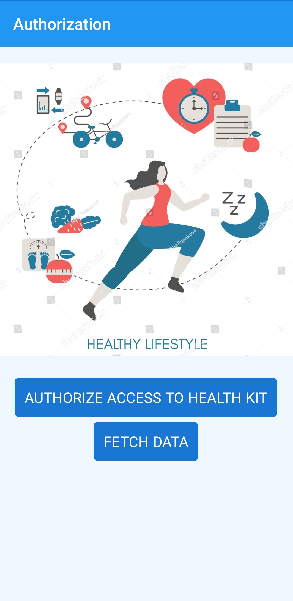
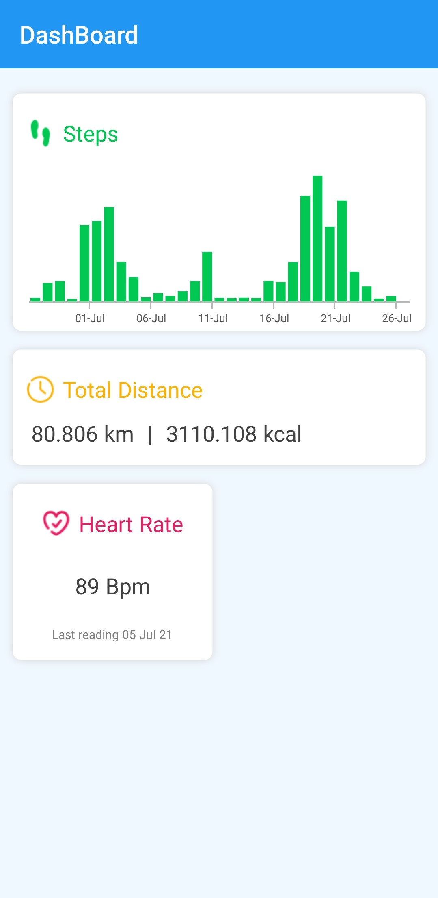

#  A Simple Health Dashboard  

This project is a MVVM Xamarin.Forms app that shows how to create a Huawei Health integrated dashboard to display some basic information like the number of steps, total distance, total calories and heart rate. 

 
 

## Getting Started

To run this app, you need to be a registered as Huawei Mobile Developer and create an application in Huawei App Console in order to use Huawei Health SDK. You can follow these steps to complete the configuration that required for development:

1. [Configuring App Information in AppGallery Connect](https://developer.huawei.com/consumer/en/doc/development/HMS-Plugin-Guides/config-agc-0000001074109946)
2. [Adding the App ID Information](https://developer.huawei.com/consumer/en/doc/development/HMS-Plugin-Guides/setting-package-0000001134821779#EN-US_TOPIC_0000001134821779__section922818182101)

## References

- [Official Health Kit documnet](https://developer.huawei.com/consumer/en/doc/development/HMS-Plugin-Guides/health-introduce-0000001073349887)
- [Medium Article](https://medium.com/huawei-developers/create-a-huawei-health-integrated-dashboard-in-xamarin-forms-b9b3dfab7247) 

